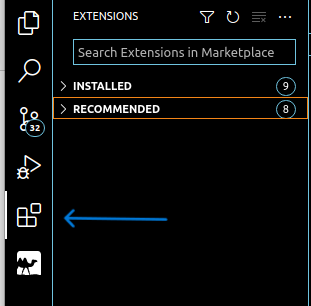
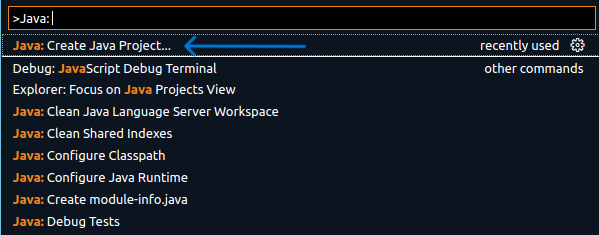
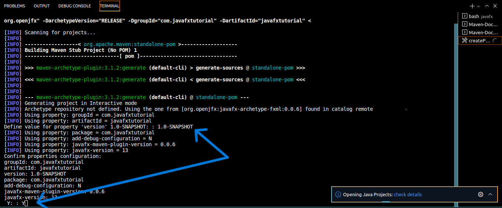

> This tutorial was modeled after previous CSCI TAs, Brock Shamblin and Tien Dinh

# Creating a JavaFX Project in VS Code

This tutorial is for those of you who have been coding in VS Code for this entire class.
>Note: If you have IntelliJ already installed in a convenient machine, then I highly recommend using that instead, as it is specifically designed to run Java programs.

## VS Code

### Download
VSCode can be downloaded from the Microsoft website [here](https://code.visualstudio.com/). Make sure you download the version compatible with your OS.

You might want to get yourself familiar to VSCode if you haven’t used it before. This is a great text editor that offers many different features which can help enhance your coding experiences. You can have a look at Microsoft’s [tutorial](https://code.visualstudio.com/docs/introvideos/basics) if you feel the need for it, this tutorial only focuses on remote editing capability of VSCode.

**IMPORTANT:** Make sure you have at least JDK v.11.0 installed. If you are SSHing into a lab machine through VS Code, you don't need to worry about this.
You can see what java version you have installed by typing   `java --version` in Terminal.

## Installing VS Code Extensions
To be able to run JavaFX Programs in VS Code, you will need the following extensions:
* [Extension Pack for Java](https://marketplace.visualstudio.com/items?itemName=vscjava.vscode-java-pack)
* [Maven for Java](https://marketplace.visualstudio.com/items?itemName=vscjava.vscode-maven)

To download an extension, click on the extensions tab:

Search for "Extension Pack for Java" and install the package. Do the same for "Maven for Java":

After installing the extensions, you might have to close and reopen VSCode. If the installation process completed without any error, you should get a VS Code notification for it, or the buttons for the exension should say "Disable" or "Uninstall" like it does for me above.

## Creating a JavaFX Project
Now, it's time to create the project.  
**For Windows keyboards/users:** Type Ctrl+Shift+P in VS Code.  
**For Mac users:** Type Command+Shift+P in VS Code.

You should get a prompt at the top of your window. Type "Java", and then select "Create Java Project'. Your commands will be in a different ordering than mine:

Once you click this, you should get a option to select which type of Java Project you want. Select "JavaFX":

Next, you will be prompted to input the groupID of your project. The makers of IntelliJ claim that this needs to be the "name of the package that will be created together with the project", which basically just means that the folder that your project lives in will have this name, so just format it as "com.PROJECT-NAME".

I will be naming my project "javafxtutorial"
.

Next, you will be asked to input the artifact ID of your project in a "Create Maven Project" popup. I'm relatively sure you will never need to understand what this means, so just name it the same as your project name without the "com." at the beginning

You should be prompted to select the folder in which you want your project to be in. Select the **parent folder** of your project, and click OK once your are inside the parent folder.

Next, you'll get a bunch of log input in your VS Code Terminal, followed by a prompt of what to define your property 'version' as. This is for developers who are have multiple iterations in their development cycle for a project. For now, type `1.0-SNAPSHOT` in the terminal and press Enter. You will be prompted again to confirm. Type `Y` and then press Enter again. 

After pressing Enter, You'll see some more output, and somehwhere in there should be a green "BUILD SUCCESS". This means that your project was successfully built! 

> Note: JavaFX Projects in VS Code default to a "Select one of two buttons" application, instead of the typical "Hello" application in IntelliJ. (For 2081 students, if you explain this to the TA, you should be getting checked off for Milestone 1).

## Running a JavaFX Project

In the bottom right corner of your VS Code, you should see a tab called "Maven". Click the dropdown for this, and then click the dropdown of your project name. You should get something that looks like this:

To run your project, click the dropdown for `Plugins > javafx > run`. 

**Trouble with the Maven Dropdown?**
from Terminal, type: 
`mvn javafx:run -f "/YOUR/FULL/ADDRESS/FROM/HOME/javafxtutorial/pom.xml"`

...except replace 'javafxtutorial' with your project name.
 
Once you click the play button on run, you should see a screen like this

## Quitting/Closing your project

Either type Ctrl+C in the Terminal, or press the X on the project popup.